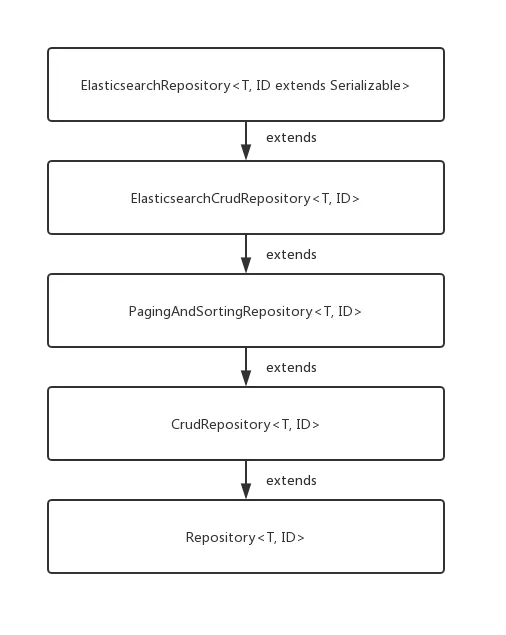

# Spring boot学习

## 补充：工厂模式

现在有一个抽象类/接口：Computer; 而computer分为PC、laptop等类别。

一般的解决方案就是接口+implements+new直接声明

但是在new之前可以再新建一个**工厂层**，通过给工厂层传入信息（比如类名、参数初始化条件等）来返回所需实例对象。


> new一个工厂，用函数getComputer(电脑名，显卡信息...)来返回实例对象。
>
> - 面向接口编程，体现了面向对象的思想；
> - 将创建对象的工作转移到了工厂类；

## JAVA 中的 @ —— 注解机制

[springboot需要的注解使用方法都在里面](https://www.cnblogs.com/itdragon/p/7718111.html)

这里举几个例子：

```java
   /**
     * 常用知识点：在类或者方法上使用 @RequestMapping 注解
     * 若没有修饰类，则访问路径是: http://ip:port/项目名/方法的@RequestMapping值
     * 若类有修饰类，则访问路径是: http://ip:port/项目名/类的@RequestMapping值/方法的@RequestMapping值
     */

    /**
     * 方法中用map作为参数，可以将数据存储到request作用域中，放回到页面上。
     * 同样用法的有  Model 类型 和  ModelMap 类型
     */
    @RequestMapping("/testMapResult")
    public String testMapResult(Map<String, Object> map, Model model, ModelMap modelMap){
        String apiDocs = "Map,Model,ModelMap (常用方法) : 在方法中添加Map的参数，可以将数据放到request 作用域中！";
        map.put(RESULT_KEY, apiDocs);
        model.addAttribute("model", "Model");
        modelMap.addAttribute("modelMap", "ModelMap");
        return SUCCESS;
    }
```


### 注解详解


#### 1.与配置文件有关：

##### 1. 1 @Value


```java
@Value("${key}")
String yes;
```

自绑定propertise中的key-value到yes变量中。


## JAVA中的Bean

Bean是一个特殊的类，其必须包含：

- 属性
- 行为


## DI —— 依赖注入

以Java为例，考虑这样一个简单的情况，我们有一个`Car`类和一个`Engine`类，`Car`类依赖于`Engine`类：

```
javaCopy codepublic class Car {
    private Engine engine;

    public Car() {
        engine = new Engine();
    }
}
```

在这个例子中，`Car`类直接创建了一个`Engine`对象，这就意味着`Car`类和`Engine`类是紧密耦合的。如果我们想要更换一个不同类型的`Engine`，或者想要在测试`Car`类时使用一个模拟的`Engine`对象，那么我们就必须修改`Car`类的代码。

但是如果我们使用依赖注入，情况就会变得不同：

```
javaCopy codepublic class Car {
    private Engine engine;

    public Car(Engine engine) {
        this.engine = engine;
    }
}
```

现在，`Car`类不再直接创建`Engine`对象，而是通过构造函数接收一个`Engine`对象。这个`Engine`对象是由外部的实体创建并注入的，`Car`类只是使用它。这样，我们就可以在不修改`Car`类的代码的情况下，为它提供不同类型的`Engine`对象，或者在测试时使用模拟的`Engine`对象。

这就是依赖注入的基本概念。在实际的应用中，依赖注入通常由专门的框架来实现，比如Java的Spring框架，.NET的Unity框架等。这些框架提供了更加强大和灵活的依赖注入机制，可以处理更复杂的情况和需求。

## thymeleaf 与 html


## id属性和name属性

当你在 HTML 表单中创建一个输入元素（如 `<input>` 或 `<textarea>`）时，`id` 和 `name` 属性都可以被用来标识这个元素，但它们的用途是不同的。

`id` 属性通常用于 JavaScript 和 CSS。当你需要通过 JavaScript 来获取或操作一个 HTML 元素，或者通过 CSS 来应用样式时，你会使用 `id` 属性。`id` 的值在一个 HTML 文档中必须是唯一的。

而 `name` 属性则用于提交表单数据。当你提交一个表单时，浏览器会收集所有有 `name` 属性的表单元素的值，并把它们编码成一个查询字符串或一个多部分的消息体，然后发送到服务器。在服务器端，你可以通过 `name` 属性的值来获取每个表单元素的值。

## @ModelAttribute —— 硬核参数绑定

```java
@RequestMapping(value = "/{reader}", method = RequestMethod.POST)
    public String addToReadingList(@PathVariable("reader") String reader, @ModelAttribute Book book) {
        System.out.println("XXXXXXXXXXXXXXXXXXXXXXXXXXXXXXXXXXXXXXXXX");
        System.out.println(book); // 打印出 book 对象的值
        System.out.println("XXXXXXXXXXXXXXXXXXXXXXXXXXXXXXXXXXXXXXXXX");
        book.setReader(reader);
        //save是继承JpaRepository的18个方法之一，但是你不需要去实现。It's magic!
        readingListRepository.save(book);//
        return "redirect:/readingList/{reader}";
    }
```

在此示例中，我提交的只是author、reader等等零散的字段内容。springboot为尝试使用你提交的内容，调用setauthor()、setreader()的方法将你提交的`属性`整合为一个`实体book`。

但是需要在注入前设定`@ModelAttribute`


## 安全过滤链（Security Filter Chain）

在Web应用中，拦截请求的目的主要是为了实现**身份认证**、权限控制以及一些其他的处理逻辑。例如，你可能需要确保只有已经登录的用户才能访问某些URL，或者只有拥有特定权限的用户才能执行某些操作。这些都需要通过拦截请求来实现。

在Spring Security中，你可以通过配置安全过滤链（Security Filter Chain）来拦截请求。你可以为特定的URL模式指定相应的权限要求，Spring Security会在每个请求到达时检查这些权限要求。

至于URL的内容，一般来说，是由前端和后端协商确定的。前端需要知道要请求哪些URL以获取或操作所需的数据，后端则需要实现这些URL对应的处理逻辑。通常，在项目的设计阶段，前端和后端会协商确定一个API规范，这个规范就定义了各种URL以及对应的请求和响应格式。

用户也可以悄悄地在地址栏进行更改，以攻击、注入进行`hacking`

> 在WebSecurityConfigurerAdapter过时之后，一般自己写个`bean`
>
> ```java
> @Bean
>     public SecurityFilterChain securityFilterChain(HttpSecurity http) throws Exception {
>         http.authorizeHttpRequests((authz) -> authz
>                         .anyRequest().authenticated()
>                 )
>                 //.httpBasic(withDefaults()); 这种方法不提供密码保护机制，不适合生产环境。
>                 .formLogin(withDefaults());
>         return http.build();
>     }
> ```

就像说话一样,`.anyRequest().authenticated()`意思就是说any请求都需要认证。

有个表：


## JSON数据返回

[返回JSON数据的教程](https://blog.csdn.net/u012702547/article/details/99543730)

## 谁来决定url的跳转？

controller层

## javax.validation找不到

很多javax包下的东西转移到了jakarta下，把javax换成jakarta就行。

## 添加新注解：@IsEmailValid

### 优点

- 在提交到model层之前就检查

### 步骤：

- 先定义注解类
- 在实现逻辑实现类validator

新建一个注解文件IsEmailValid代码示例：
package com.yyh2023.myblog1.validation;

import jakarta.validation.Constraint;
import jakarta.validation.Payload;

import java.lang.annotation.Documented;
import java.lang.annotation.Retention;
import java.lang.annotation.Target;

import static java.lang.annotation.ElementType.ANNOTATION_TYPE;
import static java.lang.annotation.ElementType.FIELD;
import static java.lang.annotation.ElementType.TYPE;
import static java.lang.annotation.RetentionPolicy.RUNTIME;

@Target({ TYPE, FIELD, ANNOTATION_TYPE })
@Retention(RUNTIME)
@Constraint(validatedBy = EmailValidator.class)
@Documented
public @interface IsEmailValid {
    String message() default "邮箱校驗失敗";

```java
Class<?>[] groups() default {};

Class<? extends Payload>[] payload() default {};
```
}

> chat:
> 在Java中定义一个新的注解，你需要以下步骤：
>
> 1. 定义注解接口
>
>    ：使用
>
>    ```
>    @interface
>    ```
>
>     关键字定义一个新的注解，如：
>
>    ```
>    javaCopy codepublic @interface MyAnnotation {
>    }
>    ```
>
> 2. 添加元注解
>
>    ：元注解是应用到其他注解上的注解。常用的元注解有：
>
>    - `@Target`：表示这个注解可以用在什么地方，如类型（类、接口、枚举等）、方法、属性等。
>    - `@Retention`：表示这个注解在什么级别可用，如源码级别（SOURCE）、类文件级别（CLASS）或运行时级别（RUNTIME）。
>    - `@Documented`：表示如果一个类型使用了被 `@Documented` 注解的注解，那么这个注解会被javadoc工具记录。默认情况下，javadoc是不包括注解的。
>    - `@Inherited`：表示这个注解可以被子类继承。
>
>    ```
>    javaCopy code@Target(ElementType.TYPE)
>    @Retention(RetentionPolicy.RUNTIME)
>    public @interface MyAnnotation {
>    }
>    ```
>
> 3. 添加注解的元素
>
>    ：在注解中可以定义一些元素，这些元素可以接受参数值，如：
>
>    ```
>    javaCopy codepublic @interface MyAnnotation {
>        String value() default "";  // 元素value，如果一个注解内只有一个元素，那么元素的名字必须取名为value
>        int number() default 0;
>    }
>    ```
>
> 在你的场景中，定义一个用于数据验证的自定义注解，除了上述基本步骤，还要在注解中指定 `@Constraint(validatedBy)` 元注解，`validatedBy`的值就是你自定义的校验类，如：
>
> ```
> javaCopy code@Target({ElementType.FIELD, ElementType.METHOD})
> @Retention(RetentionPolicy.RUNTIME)
> @Constraint(validatedBy = MyValidator.class)
> public @interface MyAnnotation {
>     String message() default "default message";  // 提示信息
>     Class<?>[] groups() default {};
>     Class<? extends Payload>[] payload() default {};
> }
> ```
>
> 其中，`MyValidator`类需要实现 `ConstraintValidator<MyAnnotation, T>` 接口，`T` 是你需要验证的数据类型。
>
> 上述步骤完成后，你就可以在你的代码中使用 `@MyAnnotation` 注解，并由 `MyValidator` 类对被注解的元素进行验证了。

## 无法从static上下文调用非static方法

检查方法的调用，你肯定大写了。


## 注解的理解、

### @requestMapping

然后你可以在每个处理方法上面再加上`@GetMapping`或`@PostMapping`，这些方法上的路径将会附加在类级别的路径后面。举个例子，如果在一个有`@RequestMapping("/comment")`注解的Controller类中，某个方法上有个`@PostMapping("/publish")`，那么这个方法的完整URL路径将会是`/comment/publish`。

> 就是说getMapping和postMapping都会把url附加在类级别的路径后面。

### @requestParam

public String publishComment(@RequestParam("content") String content){    // 这里的 content 参数会接收到 HTTP 请求中名为 "content" 的参数的值 }


## Elasticsearch：



## Javascript 中的相对路径 —— 浏览器莫名的MIME错误

都是基于当前`url`的，而不是文件路径。

当然，我很愿意解释一下相对路径和绝对路径在web上是如何工作的。

## 相对路径

相对路径是基于当前页面的URL。例如，如果你的当前页面的URL是`http://example.com/folder1/page.html`，并且你在该页面上使用相对路径`images/picture.jpg`，那么这个图片的完整URL将是`http://example.com/folder1/images/picture.jpg`。

使用`.`和`..`可以在相对路径中引用当前目录和上级目录。例如，`./style.css`引用的是与当前页面在同一目录下的`style.css`文件，`../style.css`则引用的是上级目录中的`style.css`文件。

## 绝对路径

绝对路径始终从网站的根目录开始。在URL中，根目录通常是主机名后的第一个斜杠。例如，如果你在`http://example.com/folder1/page.html`这个页面使用绝对路径`/images/picture.jpg`，那么图片的完整URL将是`http://example.com/images/picture.jpg`。

## 基于协议的绝对路径

还有一种特殊类型的绝对路径，它以两个斜杠开始，如`//another-example.com/images/picture.jpg`。这种路径的行为与绝对路径类似，但它允许你指定一个完全不同的主机名。注意，它会使用当前页面的协议（通常是HTTP或HTTPS）。因此，如果当前页面的URL是`http://example.com/folder1/page.html`，那么图片的完整URL将是`http://another-example.com/images/picture.jpg`。

以上就是web上的路径规则。你在处理链接、图片、脚本和样式表等资源时，都可以使用这些规则。你应该根据需要选择使用相对路径还是绝对路径。通常，如果资源与页面在同一网站上，使用相对路径会更方便。然而，如果你希望确保在任何情况下都能正确加载资源，无论页面的URL如何变化，那么使用绝对路径可能更合适。
